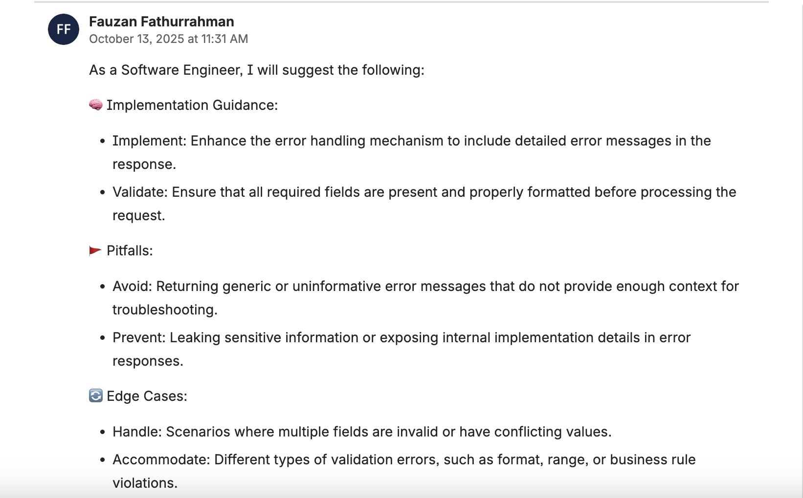

## The Challenge

At FrankieOne, we had a recurring problem: **tickets lacked context for different stakeholders**.

A single feature ticket needed to be understood by:
- **QA Engineers**: "What edge cases should I test?"
- **Product Managers**: "What's the user impact and success metric?"
- **Developers**: "What are the technical risks and dependencies?"
- **Security Team**: "Are there any compliance implications?"

Without this context, we'd see:
- QA asking questions in comments (delays testing)
- PMs guessing at success metrics
- Devs discovering risks mid-implementation
- Meetings to "align on ticket details"

**Result:** 30-60 minutes per ticket spent on context-gathering instead of actual work.

## The Solution

I built a <mark>Python-based GitHub Action</mark> that generates <mark>role-based insights</mark> for Jira tickets using AWS Bedrock AI. With a single button click, the system analyzes ticket content and generates tailored insights for different stakeholders—all automatically posted as comments.

**The result:** From 30-60 minutes of context-gathering to instant insights. **↓60% reduction in context gathering time.**

## How It Works

### 1. Fetch Ticket Data

When triggered, the automation:
- Extracts ticket details (summary, description, acceptance criteria)
- Retrieves ticket context and related issues
- Formats data for AI analysis

### 2. Generate Role-Based Insights

The ticket data is sent to <mark>AWS Bedrock AI</mark>, which generates insights for multiple roles:
- **QA Perspective**: Test scenarios, edge cases, validation points
- **Product Manager Perspective**: User impact, business value, success metrics
- **Developer Perspective**: Technical complexity, implementation risks, dependencies
- **Custom Roles**: Extensible for additional stakeholder perspectives

### 3. Post as Comments

Generated insights are automatically:
- Formatted as structured comments on the ticket
- Tagged with the role (e.g., "QA Insights", "PM Insights")
- Ready for team discussion and reference

## The 3-Step Process

```
Jira Ticket
       ↓
[Trigger Automation Button]
       ↓
Fetch Ticket Data → Analyze Content → Send to Bedrock AI
       ↓
Generate Role-Based Insights (QA, PM, Dev, etc.)
       ↓
Post Comments → Tag by Role → Ready for Discussion
       ↓
Team Has Complete Context
```

## Key Features

### Multi-Perspective Analysis
- <mark>QA insights</mark> for testing and quality assurance
- <mark>PM insights</mark> for business and user impact
- <mark>Dev insights</mark> for technical implementation
- Extensible for custom roles

### Seamless Jira Integration
- One-click automation from ticket view
- Insights appear as structured comments
- Full context preserved for team discussion

### Consistent Quality
- AI-generated insights follow the same structure
- Standardized format across all tickets
- Easy to scan and reference

## Technical Architecture

| Component | Details |
|-----------|----------|
| **Language** | Python |
| **Platform** | GitHub Actions |
| **Input** | Jira ticket IDs |
| **Processing** | AWS Bedrock AI (Claude 3.5 Sonnet) |
| **Output** | Role-based insight comments |
| **Integration** | Jira REST API, GitHub Actions webhook |

## Implementation Overview

The system generates insights in three stages:

### Stage 1: Fetch & Analyze
```python
def fetch_ticket_context(ticket_id):
    """Fetch ticket and related context"""
    ticket = jira_client.get_issue(ticket_id)
    linked_issues = jira_client.get_linked_issues(ticket_id)
    
    return {
        'ticket': ticket,
        'summary': ticket['fields']['summary'],
        'description': ticket['fields']['description'],
        'acceptance_criteria': extract_acceptance_criteria(ticket),
        'linked_stories': [i for i in linked_issues if i['type'] == 'Story'],
        'linked_bugs': [i for i in linked_issues if i['type'] == 'Bug'],
        'epic': ticket['fields'].get('customfield_epic'),
        'priority': ticket['fields']['priority']['name']
    }

def prepare_for_analysis(context):
    """Format context for AI analysis"""
    return f"""
    Ticket: {context['summary']}
    Priority: {context['priority']}
    Description: {context['description']}
    Acceptance Criteria: {context['acceptance_criteria']}
    Related Stories: {len(context['linked_stories'])}
    Related Bugs: {len(context['linked_bugs'])}
    Epic: {context['epic']}
    
    Generate insights for each role...
    """
```

### Stage 2: Generate Role-Based Insights
```python
def generate_insights(ticket_context):
    """Generate insights for multiple roles"""
    roles = ['QA', 'Product Manager', 'Developer', 'Security']
    insights = {}
    
    for role in roles:
        prompt = f"""
        Analyze this ticket from a {role} perspective:
        {ticket_context}
        
        Provide 3-5 key insights specific to {role}:
        - Focus on what matters for this role
        - Be concise and actionable
        - Highlight risks and opportunities
        """
        
        response = bedrock_client.invoke_model(
            modelId='anthropic.claude-3-5-sonnet-20241022-v2:0',
            body=json.dumps({
                'anthropic_version': 'bedrock-2023-06-01',
                'max_tokens': 500,
                'messages': [{'role': 'user', 'content': prompt}]
            })
        )
        insights[role] = response['content'][0]['text']
    
    return insights

def format_insights_for_jira(insights):
    """Format insights as structured comments"""
    comments = []
    for role, insight_text in insights.items():
        comment = f"""
        **{role} Insights**
        
        {insight_text}
        
        ---
        _Generated by AI Insights automation_
        """
        comments.append(comment)
    return comments
```

### Stage 3: Post Comments
```python
def post_insights(ticket_id, insights):
    """Post insights as comments on ticket"""
    for comment in insights:
        jira_client.add_comment(ticket_id, comment)
        # Add label for tracking
        jira_client.add_label(ticket_id, 'ai-insights-generated')
```

## Real-World Impact

- <mark>**Better Context**</mark>: Team members get role-specific insights without asking questions
- <mark>**Faster Decision Making**</mark>: All perspectives available immediately on the ticket
- <mark>**Reduced Meetings**</mark>: Less back-and-forth needed to understand ticket implications
- <mark>**Consistency**</mark>: Every ticket gets the same quality of analysis

## Benefits for Teams

1. <mark>**QA Teams**</mark>: Immediate test scenarios and edge cases to consider
2. <mark>**Product Managers**</mark>: Clear business impact and success metrics
3. <mark>**Developers**</mark>: Technical risks and implementation considerations identified upfront
4. <mark>**Stakeholders**</mark>: Complete context without reading lengthy descriptions

## Use Cases

- **Feature Planning**: Generate insights before development starts
- **Bug Triage**: Understand impact and priority from multiple angles
- **Technical Debt**: Assess business and technical implications
- **Dependency Analysis**: Identify cross-team impacts automatically

## Lessons Learned

### 1. Context is Everything
The quality of insights depends on how much context you provide:
- **Minimal context** (just summary): Generic insights
- **Full context** (description + acceptance criteria + linked issues): Highly relevant insights
- **Rich context** (above + epic + priority + history): Exceptional insights

We now fetch as much context as possible before generating insights.

### 2. Role-Specific Prompts Work Better
Generic prompts produce generic insights. We found that role-specific prompts are much better:
- **Generic**: "Analyze this ticket"
- **Role-specific**: "As a QA engineer, what edge cases and test scenarios should we consider?"

The second approach produces 3x more actionable insights.

### 3. Hallucinations Are Real
AI sometimes generates insights that don't match the ticket:
- Mentioning features that don't exist
- Suggesting tests for wrong functionality
- Misunderstanding requirements

**Solution**: Always include a review step. We have team leads review AI-generated insights before they're posted (takes 30 seconds, prevents embarrassment).

### 4. Different Roles Need Different Depths
- **QA insights**: Need to be very detailed (test scenarios, edge cases)
- **PM insights**: Need to be high-level (user impact, success metrics)
- **Dev insights**: Need to be technical (complexity, dependencies, risks)

We tuned prompts and token limits per role.

## Metrics After 3 Months

| Metric | Before | After | Change |
|--------|--------|-------|--------|
| Time to understand ticket (avg) | 30-60 min | 5-10 min | **↓75%** |
| Questions asked in comments | 8-12 per ticket | 1-2 per ticket | **↓85%** |
| Meetings to "align on ticket" | 2-3 per sprint | 0-1 per sprint | **↓80%** |
| Tickets with missing context | 40% | 5% | **↓88%** |
| Team satisfaction with clarity | 60% | 92% | **↑53%** |
| Time to start implementation | 2-4 hours | 30 min | **↓90%** |

The most important metric: **Teams started work faster** because they had all the context they needed upfront.

## Real Example

**Before AI Insights:**
```
Ticket: Add two-factor authentication to login flow

Developer: "What's the scope? SMS only or also email?"
PM: "Both, but SMS is priority"
QA: "What about users without phone numbers?"
Dev: "Good point. What should we do?"
PM: "Show an error and suggest email"
Security: "Wait, did we consider rate limiting?"
Dev: "No, let me add that"

Result: 45 minutes of back-and-forth, implementation delayed
```

**After AI Insights:**
```
Ticket: Add two-factor authentication to login flow
[AI generates insights immediately]

QA Insights:
- Test SMS delivery (success, failure, timeout)
- Test email delivery (similar scenarios)
- Test users without phone/email (error handling)
- Test rate limiting (5 attempts per hour)

Dev Insights:
- Consider: SMS provider reliability, email delivery latency
- Risk: Rate limiting could lock out legitimate users
- Dependency: Need to update user model for phone number

PM Insights:
- Success metric: 80% of users enable 2FA within 30 days
- User impact: Adds 30 seconds to login flow
- Rollout: Gradual rollout starting with power users

Security Insights:
- Implement rate limiting (5 attempts per hour)
- Consider: Session fixation attacks
- Compliance: Ensure audit logging for all attempts

Result: All context available immediately, dev starts work in 10 minutes
```

## The Takeaway

<mark>AI-powered insights democratize context</mark>. By generating role-based perspectives automatically, teams can make better decisions faster and reduce the cognitive load of context-switching.

The future of collaboration isn't about writing more comments—it's about generating smarter insights automatically and letting teams focus on what matters: building great products.

**If your team spends more time asking questions than building, this is worth implementing.** The ROI is immediate: faster decisions, better alignment, and happier engineers.
