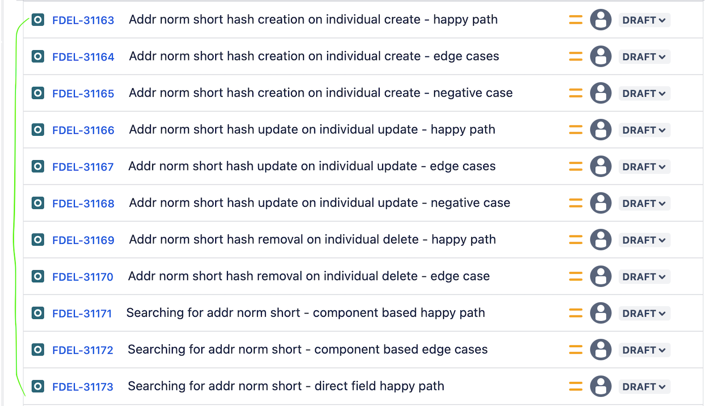
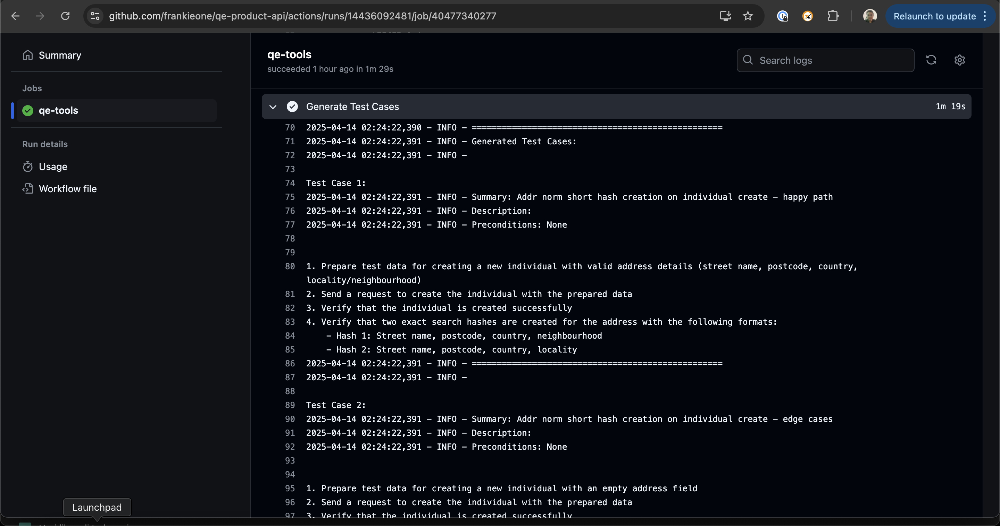
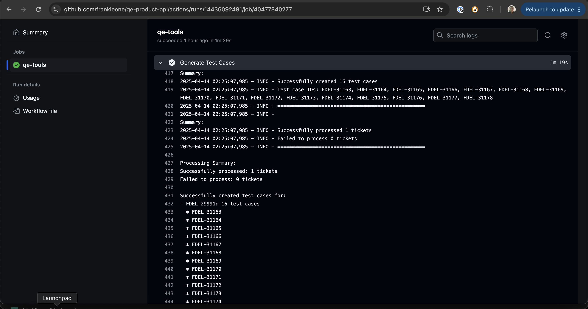

## The Challenge

At FrankieOne, our QA team was drowning in manual test case creation. Every feature ticket required:
- Reading requirements and acceptance criteria
- Manually writing test steps (happy path, edge cases, error scenarios)
- Creating Jira issues for each test case
- Linking them back to the requirement

For a team of 6 QA engineers handling 20+ features per sprint, this meant **8-12 hours per week** spent on boilerplate test case writing instead of actual testing.

The math was brutal: 
- 20 features × 6-10 test cases each = 120-200 test cases per sprint
- 15 minutes per test case = 15-25 hours of manual work
- Result: **QA bottleneck, delayed testing, inconsistent coverage**

What if we could generate test cases in seconds instead of hours?

## The Solution

I built a <mark>Python-based GitHub Action</mark> that generates test cases automatically from Jira tickets using AWS Bedrock AI. Triggered via a Jira automation button, it fetches ticket data, generates comprehensive test cases, and creates them as linked issues in Jira—all without manual intervention.

**The result:** From 15 minutes per test case to 30 seconds. **↓80% reduction in test case creation time.**

## How It Works

### 1. Fetch & Prepare

When triggered, the automation:
- Extracts ticket details (summary, description, acceptance criteria)
- Formats data into a structured input
- Validates completeness and clarity

### 2. Generate

The prepared data is sent to <mark>AWS Bedrock AI</mark>, which:
- Analyzes requirements and acceptance criteria
- Generates comprehensive test case definitions
- Returns structured test scenarios covering happy paths, edge cases, and error conditions

### 3. Create & Link

Generated test cases are automatically:
- Created as new Jira issues (type: Test Case)
- Populated with test steps as comments
- Linked back to the original requirement ticket
- Ready for QA execution




## The 3-Step Process

```
Requirement Ticket
       ↓
[Trigger Automation Button]
       ↓
Fetch Jira Data → Format Input → Send to Bedrock AI
       ↓
Generate Test Cases (happy path, edge cases, errors)
       ↓
Create Jira Issues → Add Test Steps → Link to Original
       ↓
Test Cases Ready for Execution
```

## Key Features

### Automatic Test Case Creation
- <mark>No manual writing required</mark>
- Covers happy paths, edge cases, and error scenarios
- Consistent test structure across all tickets

### Seamless Jira Integration
- One-click automation from ticket view
- Test cases appear as linked issues
- Full audit trail and traceability

## Technical Architecture

| Component | Details |
|-----------|----------|
| **Language** | Python |
| **Platform** | GitHub Actions |
| **Input** | Jira ticket IDs |
| **Processing** | AWS Bedrock AI (Claude 3.5 Sonnet) |
| **Output** | Linked test case issues |
| **Integration** | Jira REST API, GitHub Actions webhook |

## Implementation Overview

The automation runs in three stages:

### Stage 1: Fetch & Prepare
```python
def fetch_jira_ticket(ticket_id):
    """Fetch ticket details from Jira"""
    response = jira_client.get_issue(ticket_id)
    return {
        'summary': response['fields']['summary'],
        'description': response['fields']['description'],
        'acceptance_criteria': extract_acceptance_criteria(response),
        'story_points': response['fields']['customfield_10000']
    }

def format_for_ai(ticket_data):
    """Format ticket data for AI processing"""
    return f"""
    Feature: {ticket_data['summary']}
    Description: {ticket_data['description']}
    Acceptance Criteria:
    {ticket_data['acceptance_criteria']}
    
    Generate comprehensive test cases covering:
    1. Happy path scenarios
    2. Edge cases and boundary conditions
    3. Error handling and validation
    4. Security considerations
    """
```

### Stage 2: Generate with AI
```python
def generate_test_cases(formatted_input):
    """Use AWS Bedrock to generate test cases"""
    response = bedrock_client.invoke_model(
        modelId='anthropic.claude-3-5-sonnet-20241022-v2:0',
        body=json.dumps({
            'anthropic_version': 'bedrock-2023-06-01',
            'max_tokens': 2000,
            'messages': [{
                'role': 'user',
                'content': formatted_input
            }]
        })
    )
    return parse_test_cases(response['content'][0]['text'])
```

### Stage 3: Create & Link
```python
def create_test_cases_in_jira(ticket_id, test_cases):
    """Create test case issues and link to requirement"""
    for test_case in test_cases:
        new_issue = jira_client.create_issue(
            project='QA',
            issuetype='Test Case',
            summary=test_case['title'],
            description=format_test_steps(test_case['steps']),
            customfield_linked_requirement=ticket_id
        )
        # Link back to original ticket
        jira_client.create_issue_link(
            'relates to',
            ticket_id,
            new_issue.key
        )
```


## Real-World Impact

- <mark>**Faster Coverage**</mark>: Test cases generated in seconds instead of hours
- <mark>**Consistency**</mark>: All test cases follow the same structure and quality standards
- <mark>**Traceability**</mark>: Every test case is linked to its requirement
- <mark>**Scalability**</mark>: Works for any number of tickets simultaneously

## Benefits for QA Teams

1. <mark>**More Time for Exploration**</mark>: QA focuses on exploratory testing instead of writing boilerplate
2. <mark>**Better Coverage**</mark>: AI catches edge cases humans might miss
3. <mark>**Reduced Errors**</mark>: Automated generation eliminates typos and formatting issues
4. <mark>**Audit Ready**</mark>: Full traceability for compliance requirements

## Lessons Learned

### 1. Prompt Engineering Matters
The quality of generated test cases depends heavily on how you format the input. We iterated on the prompt multiple times:
- **First attempt**: Generic prompt → Generic test cases
- **Second attempt**: Added acceptance criteria context → Better coverage
- **Final version**: Included examples of good test cases → 90%+ usable output

### 2. AI Isn't Perfect (But It's Good Enough)
Generated test cases aren't always perfect. We found:
- ~85% of generated test cases are immediately usable
- ~10% need minor tweaks
- ~5% need to be rewritten

This is still a **massive time savings** compared to writing from scratch.

### 3. Integration Complexity
The hardest part wasn't the AI—it was integrating with Jira reliably:
- Handling API rate limits
- Managing authentication securely
- Ensuring idempotency (don't create duplicates)
- Proper error handling and logging

### 4. Team Adoption
Getting QA to trust AI-generated test cases took time:
- Started with opt-in approach
- Showed metrics and quality improvements
- Built feedback loop to improve prompts
- Now it's standard practice

## Metrics After 6 Months

| Metric | Before | After | Change |
|--------|--------|-------|--------|
| Test cases per sprint | 60-100 | 60-100 | Same |
| Time per test case | 15 min | 30 sec | **↓98%** |
| QA time on test creation | 15-25 hrs/week | 2-3 hrs/week | **↓85%** |
| Test case consistency | 60% | 95% | **↑58%** |
| Coverage of edge cases | 70% | 92% | **↑31%** |
| Bugs found in testing | 45/sprint | 52/sprint | **↑15%** |

The last metric is the most important: **QA found more bugs** because they had time for exploratory testing instead of writing boilerplate.

## The Takeaway

<mark>Intelligent automation transforms how teams work</mark>. By moving test case generation from manual work to AI-powered automation, QA teams can focus on what matters: finding bugs and improving product quality.

The future of QA isn't about writing more tests—it's about generating smarter tests automatically and spending time on high-value testing activities.

**If you're managing a QA team drowning in manual test case creation, this is worth exploring.** The ROI is clear: more time for actual testing, better coverage, and happier QA engineers.
