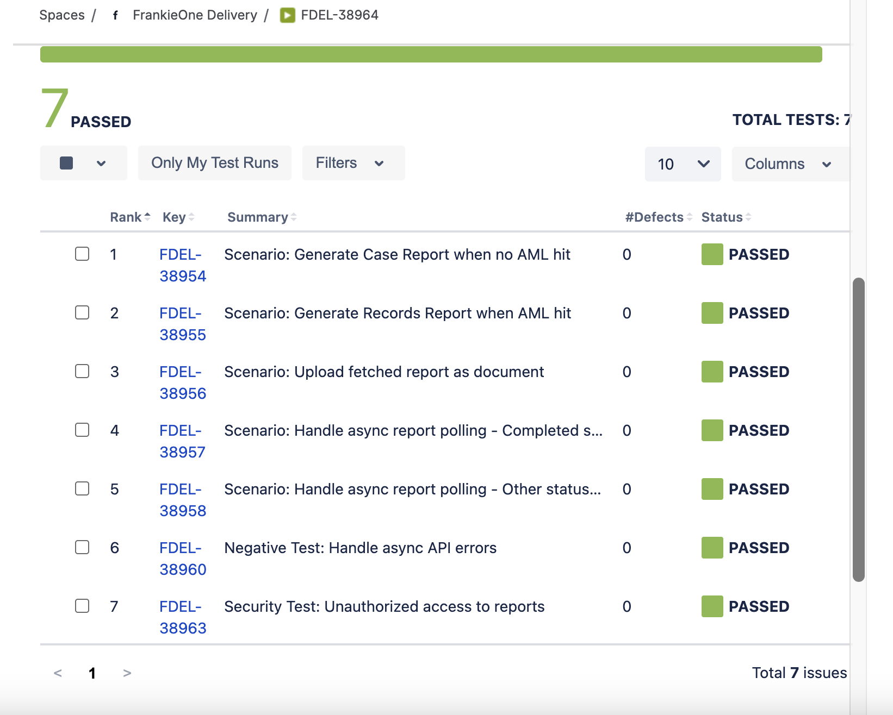

## The Challenge

Once test cases are created for a story, QA teams need to create test execution tickets to track which tests have been run and their results. Manually creating these tickets and including all test case details is tedious and error-prone.

Without automation, this becomes a bottleneck that slows down the testing workflow and creates inconsistency.

## The Solution

I built a <mark>Python-based GitHub Action</mark> that <mark>automatically creates test execution tickets</mark> in Jira. The tool fetches all linked test cases from a story, creates an execution ticket, and includes all test case details—ready for QA execution tracking.

## How It Works

### 1. Initialize Clients

When triggered, the automation:
- Establishes connection to Jira API
- Validates credentials and permissions
- Prepares for ticket creation

### 2. Create Test Execution

The system creates test execution tickets with:
- <mark>All linked test cases included</mark> from the story
- Test case details and steps embedded
- Standardized naming conventions
- Pre-configured fields and metadata
- Optional version tracking

### 3. Link to Stories

Generated test execution tickets are automatically:
- Linked to the original story tickets
- Tagged with execution metadata
- Ready for QA team assignment
- Tracked in test dashboards

## The 3-Step Process

```
Story IDs
       ↓
[Trigger Automation]
       ↓
Initialize Jira Clients → Fetch Linked Test Cases → Prepare Test Data
       ↓
Create Test Execution Tickets (with all test cases included)
       ↓
Populate Test Steps → Link to Stories → Ready for Execution
       ↓
Test Execution Tickets Ready with All Test Cases
```

## Key Features

### Automated Ticket Creation
- <mark>No manual ticket creation</mark>
- <mark>All test cases automatically included</mark>
- Consistent naming and structure across all tickets
- Pre-populated with story context and test details
- Standardized fields and metadata

### Smart Linking
- Automatically links to parent story tickets
- Maintains traceability throughout workflow
- Supports version tracking
- Creates audit trail

## Technical Architecture

| Component | Details |
|-----------|----------|
| **Language** | Python |
| **Platform** | GitHub Actions |
| **Input** | Story IDs |
| **Processing** | Jira API client initialization |
| **Output** | Linked test execution tickets |

## Real-World Impact

- <mark>**Faster Test Planning**</mark>: Test execution tickets with all test cases created in seconds
- <mark>**Complete Coverage**</mark>: All test cases automatically included in execution tickets
- <mark>**Consistency**</mark>: Every test execution ticket follows the same structure
- <mark>**Traceability**</mark>: Clear links between stories, test cases, and executions
- <mark>**Scalability**</mark>: Works for any number of stories and test cases simultaneously

## Benefits for QA Teams

1. <mark>**Reduced Manual Work**</mark>: Eliminate repetitive ticket creation tasks
2. <mark>**Better Organization**</mark>: Standardized structure makes tracking easier
4. <mark>**Faster Onboarding**</mark>: New QA members get consistent ticket structure

## Use Cases

- **Sprint Planning**: Create test execution tickets with all test cases for sprint stories
- **Release Management**: Track test execution across versions with version parameter
- **Bulk Testing**: Handle multiple stories and their test cases without manual work
- **Test Dashboards**: Maintain clear hierarchy with test cases embedded in executions
- **Test Tracking**: Execute and track results for all test cases in one ticket

## Workflow Integration

This automation fits perfectly into your Jira workflow:
1. Stories are created with acceptance criteria
2. Test cases are created and linked to stories (via AI Test Case Generator)
3. Trigger test execution creation
4. Test execution tickets appear with all test cases included
5. QA team executes tests and tracks results
6. Results tracked in execution tickets

## The Takeaway

<mark>Automation removes friction from workflows</mark>. By automating test execution ticket creation, QA teams can focus on actual testing instead of administrative overhead.

The future of QA isn't about managing tickets—it's about managing quality. Let automation handle the busywork.
